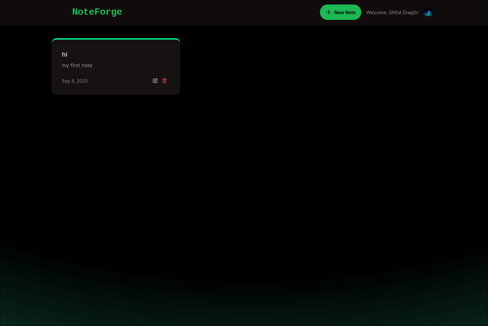

# NoteForge

A full-stack note-taking application built with the MERN stack (MongoDB, Express, React, Node.js). ThinkBoard allows users to create, view, and manage notes efficiently with a modern UI.

# Home Page



## Features

- Create, read, update, and delete notes
- Rate limiting for API requests
- Responsive design with Tailwind CSS
- RESTful API backend
- Modern React frontend with Vite

## Project Structure

```
NoteForge/
├── backend/      # Express.js API server
│   ├── src/
│   ├── controllers/
│   ├── models/
│   ├── routes/
│   └── middleware/
├── frontend/     # React client app
│   ├── src/
│   ├── components/
│   ├── pages/
│   └── lib/
├── README.md
└── package.json
```

## Getting Started

### Prerequisites

# NoteForge

A full-stack note-taking application built with the MERN stack (MongoDB, Express, React, Node.js). ThinkBoard allows users to create, view, and manage notes efficiently with a modern UI.

## Features

- Create, read, update, and delete notes
- Rate limiting for API requests
- Responsive design with Tailwind CSS
- RESTful API backend
- Modern React frontend with Vite

## Project Structure

```
NoteForge/
├── backend/      # Express.js API server
│   ├── src/
│   ├── controllers/
│   ├── models/
│   ├── routes/
│   └── middleware/
├── frontend/     # React client app
│   ├── src/
│   ├── components/
│   ├── pages/
│   └── lib/
├── README.md
└── package.json
```

## Getting Started

### Prerequisites

- Node.js & npm
- MongoDB

### Installation

1. Clone the repository:

   ```bash
   git clone https://github.com/DeepakAC3/mern-thinkboard.git
   cd mern-thinkboard
   ```

2. Install backend dependencies:

   ```bash
   cd backend
   npm install
   ```

3. Install frontend dependencies:
   ```bash
   cd ../frontend
   npm install
   ```

### Running the App (local)

1. Start the backend server:

   ```bash
   cd backend
   npm start
   ```

2. Start the frontend development server:

   ```bash
   cd frontend
   npm run dev
   ```

3. Open your browser at [http://localhost:5173](http://localhost:5173)

## Authentication (Clerk)

This project uses Clerk for authentication. Clerk is integrated on both frontend and backend:

- Frontend: `@clerk/clerk-react` with `ClerkProvider` (see `frontend/src/main.jsx`).
- Backend: `@clerk/express` middleware is applied to protect API routes (see `backend/src/middleware/clerkAuth.js`).

Environment variables used for Clerk:

- Backend (`backend/.env`):

  - `CLERK_SECRET_KEY` — server secret key (sk\_...)
  - `CLERK_PUBLISHABLE_KEY` — optional server-side copy of the publishable key (pk\_...)
  - `CLIENT_URL` — the frontend origin (used for CORS), e.g. `http://localhost:5173` or your deployed frontend URL

# NoteForge

A simple MERN notes app with Clerk authentication.

## Quick start

1. Install backend and frontend deps:

```bash
cd backend && npm install
cd ../frontend && npm install
```

2. Run locally:

```bash
# backend
cd backend && npm start

# frontend
cd ../frontend && npm run dev
```

Open http://localhost:5173

## Clerk auth (short)

- Frontend: set `VITE_CLERK_PUBLISHABLE_KEY` (build-time).
- Backend: set `CLERK_SECRET_KEY` and `CLIENT_URL` (for CORS).
- You must register your production domain in Clerk to use live production keys — Clerk requires a valid domain (ETLD+1) for cookies.

## License

MIT

```

```
